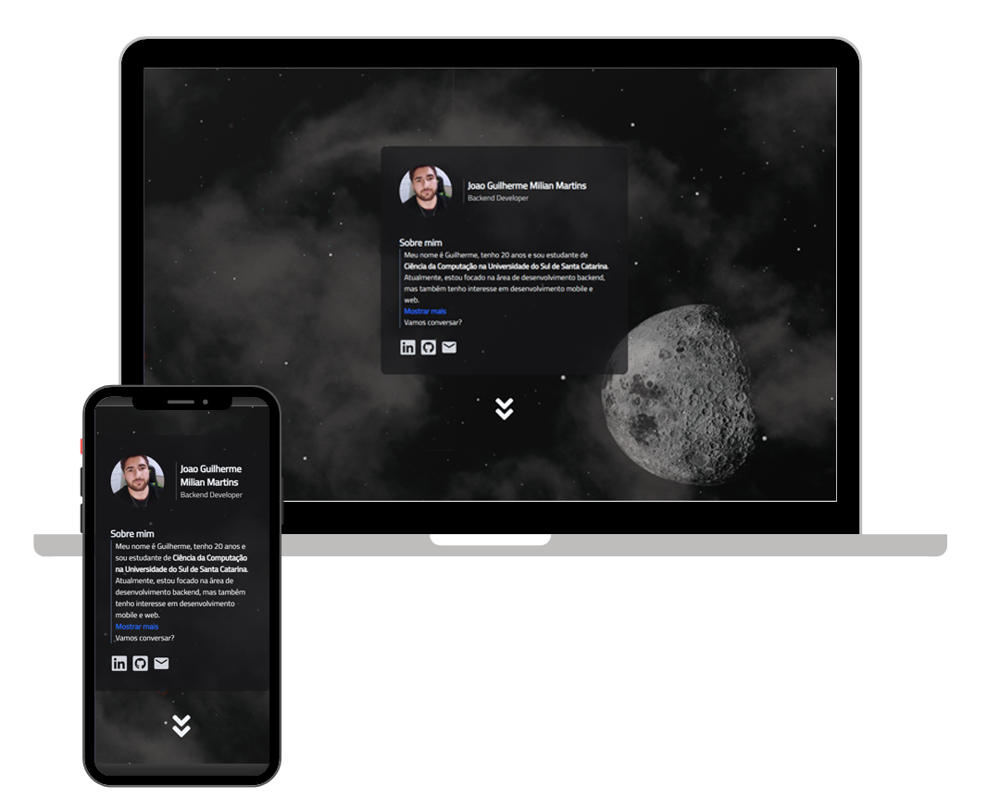

<h2 align="center">
  Portfolio Website - v1.0 
  <a href="https://xrkmed.com" target="_blank">xrkmed.com</a>
</h2>

  

 

 &nbsp;
 &nbsp;
 &nbsp;
 &nbsp;

<h3 align="center">
    🔹
    <a href="https://github.com/xrkmed/website-portfolio-react-tailwind/issues">Report Bug</a> &nbsp; &nbsp;
    🔹
    <a href="https://github.com/xrkmed/website-portfolio-react-tailwind/issues">Request Feature</a>
</h3>

## TL;DR

You can fork this repo to modify and make changes of your own. Please give me proper credit by linking back to [Xrkmed](https://github.com/xrkmed/website-portfolio-react-tailwind). Thanks!

## Built With

My personal portfolio <a href="https://xrkmed.com" target="_blank">xrkmed.com</a> which features some of my github projects as well as my resume and technical skills. 

This project was built using these technologies.

- React.js
- Vite
- Tailwind CSS
- PostCSS
- Fetch
- VsCode

**📱 Fully Responsive**